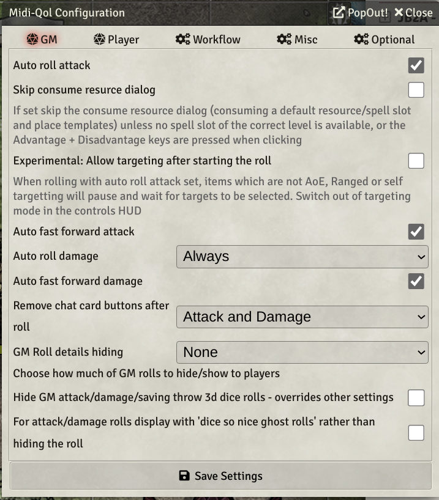
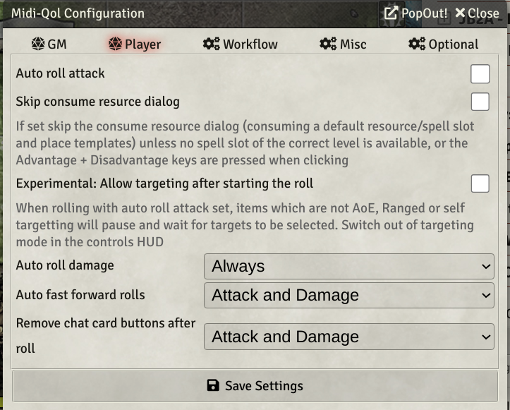
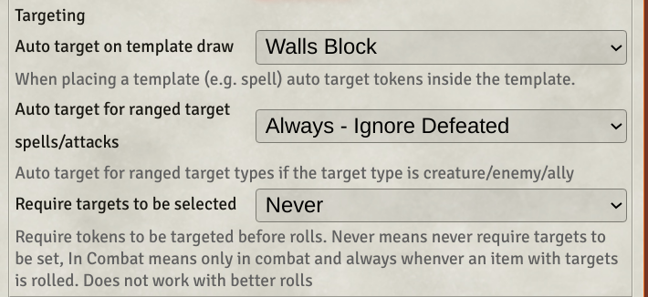
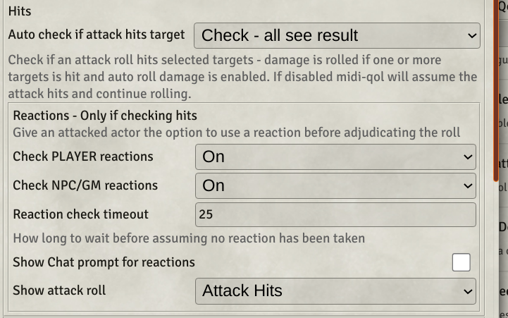
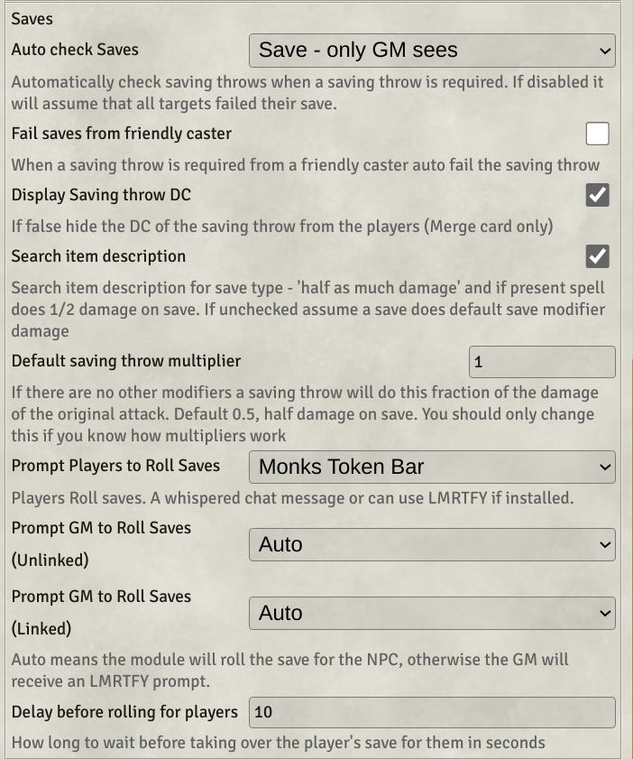
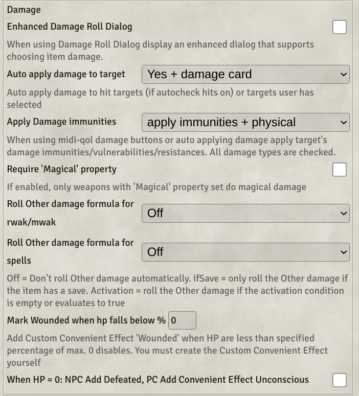
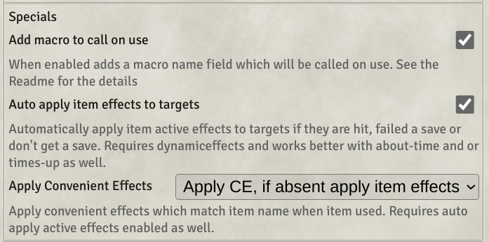
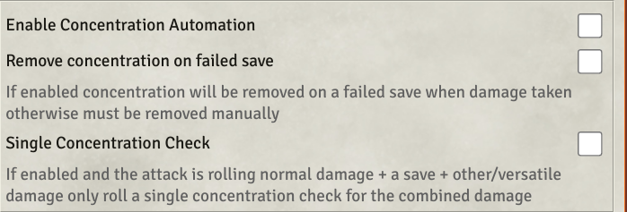

**Work in progress - not complete or checked**
[TOC]

## What is this document?
This guide is intended for new users to midi-qol who need some guidance on setting the very many options that exist.
## What can midi-qol do?
Here is a spider attacking a goblin using the base dnd5e system.  
  
Foundry has displayed a chat card with buttons on it for attack and damage and doing the saving throw. You go through the following steps
  * Press the attack button which prompts you to decide if the attack is made with advantage or disadvantage and whether there are any special bonuses, like luck/bardic inspiration.
  * Decide if the attack hit remembering to deal with any reactions the target might take, like a shield spell.
  * If the attack hit roll hit roll the damage remembering to check if it is a critical hit and if there are any special bonuses for the damage, like a mace of disruption/drgon slayer sword.
  * Roll the saving throw remembering if the save is made with advantage/disadvantage and any bonuses to apply
  * Decide if the saving throw was successful.
  * Work out how much damage to apply to the token, remembering to factor in resistance/immunities/the saving throw.
  * Apply any sepcial effects that the attack mid have, e.g. the posisoned condition.

Midi-qol exists to help you automate the some or all of these steps. Before going through the detail of how to set this up here is the same attack done with midi-qol with full automation, all accomplished with a single cick of the item button.

| Spider Bite | Extra actions generated with same click |
| ------ | ------ |
|  | <ul><li>The attack and damage rolls have been made</li><li>A check has been made to see if the attack hit the target</li><li>The damage has been rolled, the bite damage and the poison damage</li><li>The goblin has rolled the consitution save</li><li>The save has been checked and the goblin failed</li><li>The damage has been calculated and applied to the goblin. (midi knows about damage resistance and takes that into account)</li><li>A GM only summary damage card has been displayed showing what damage was done and giving the option to revise it.</li></ul> |
## I've installed it but it does not do anything....
Midi-qol is a fairly complex module with many configuration options and dependencies on other modules. To make it work you have to go through a setup process where you configure it to work the way you want.

If you are too impatient to read a getting started guide, here is the quickest way to get something working. 
  1. Install the prerequisite modules (libsocket, libwrapper and Dynami Active Effects), midi-qol won't activate without them.
  2. Got to configure settings and for midi-qol tick "Enable Combat Automation".
  3. Navigate to the midi-qol settings and click on the workflow button.
  4. Go to the quick settings tab and click full automation and confirm the changes. Midi will now do most things out of the box when you target an opponent and roll the sword.

Once you've done that come back and read through the rest of the configuation guide.

1. Install the prerequisite modules plus any nice to haves you want.
2. Configure midi-qol to work the way you want.
3. Get some midi-compatible items to make all this automation stuff work.

## Prequisites
### Modules you must also install
#### libsocket
#### libwrapper
#### Dynamic Active Effects
#### Advanced Macros
No longer required or supported.
### Modules you really should install
#### Times-up
Required if you want effects to automatically be removed on expiry, either world time on combat turn/round. If you want time to advance in your world both **Simple Calendar** and **Small Time** are highly recommended.

### Modules that are nice to have
#### Convenient Effects or Condition Lab and Triggler
Convenient Effects provides status effects, like blinded charmed and so pre-configured and can be applied to targets as the result of using an item. In addition, when using an item midi can automatically apply the convenient effects defined effects for that spell.

Condition Lab and triggler (CLT) allows configuration of status effects which you can apply with midi-qol.

### Monks Token Bar/Let Me Roll That for You.
When automating saving throws both of these modules allow you to have players roll their own saving throws and midi-qol will interact with them to prompt for and record the saving throws. Both are recommended. The only "issue" is that monk's token bar will not hide the monster names when displayed.

#### Automated Animation
This adds some nice animations to item/spell usage and is configured to work with midi-qol. Highly recommended.

#### Dice So Nice
If you like 3d dice rolled to the screen this is a must have. It is mostly compatible with midi-qol. Any oddities are the result of midi-qol.

#### Active Token Effects 
This adds to the list of effects you can apply for things like vision lighting and so on.

#### Effect Macros
Allows you run a macro when an effect is applied/created/toggled.

#### Template Macros
Allows you to run a macro when a template is created/entered/exited.

#### Active Auras
This allows effects to be applied to nearby tokens without having to trigger any items. Think Paladin's Aura of Protection

#### 
## Configuration
### Conguration overview
First enable combat automation in the midi-qol settings.
The next sections cover configuring how that combat automation works, midi refers to a attack or spell cast as a workflow. You need to click on the workflow settings to manage the next set of settings.
The steps are:
1. Configure Attack/Damage rolls
2. Configure the Workflow Tab
3. Look and feel
4. Configure Other optional settings
  * Reactions
  * Concentration
  * Optional rules
  * Mechanics.

Most setings are configured on the configuratin application (the workflow button on configure settings) and is accessible only to a GM. Some settings available to all users are on the configuration settings application from the foundry sidebar.

#### Configure attack and damage rolls
Midi has several concepts that can be confusing to first time users.
##### Rolling Attacks and Damage.
Normally when you roll an item it displays a chat card with attack and damage buttons. There are Midi settings to alter that process.
* Auto roll - dnd5e creates a chat card with attack and damage buttons when you roll an item (click on the icon next to the item in the character sheet). If a roll is "auto rolled" midi will behave as if the button had been clicked.
* FastForward - if a roll is fastforwarded the configuration dialog for that roll will be skipped when midi does the roll. For attack and damage that means the advantage/disadvantage normal/critial dialog is skipped.

* Modifier keys. When you click on a chat card button (let's assume attack) you can hold Control (disadvantage) or Alt (advantage) to skip the roll dialog and use the modifier key settings. Midi allows you to press the alt/ctrl key when clicking on the character sheet icon to auto roll the attack with advantage/disadvantage. You can configure the midi-qol keys from Configure Controls in foundry settings section.

Both of GM and Player tab lets you configure how rolling an item behaves.
* Auto Roll attack, when the item is rolled the attack is automatically rolled.
* Auto Roll damage, never, only roll if the attack hits or always.
* FastForward attack - skip the configuration dialog.
* FastForward damage - skip the damage configuration dialog.

This works fine if you are doing an ordinary attack, but sometimes you want to do some hand editing of the roll and not do everything automatically. The rollToggle key allows you to do this (dfault T). If you hold T when clicking on the item icon the normal sense of fastForwarding and auto roll is reversed. So if you were doing automatic rolls pressing T will display the Chat card for the item with attack and damage buttons ready for you to click.

##### GM Tab
  
Auto Roll Attack: if ticked GM attack rolls will be auto rolled.  
Skip Consume resource dialog: If ticked the resource consumption dialog will be skipped and default answers used, for spells this means casting at the base level.  
Late Targeting: By default midi uses the targets selected when you click the attack button. Late targeting allows you to modify the targets after the roll is started  
##### Player Tab

Similar to the GM tab but applies for non-gm players. The sae settings apply to all players.  
#### Configuring the workflow.
Midi has the concept of a workflow, when you start the attack/cast the spell midi goes through a set of steps to determine the outcome of the roll, starting with targeting and finishing with applying status conditons (like poisoned).
The workflow tab alows you to configure how each of those steps are performed and if they are automated or not.
#### Configure targeting
Midi expects you to target who you want to hit before clicking the weapon/spell you want to attack with. This can be tedious for Area of Effect Spells (fire ball) or Ranged Spells (Mass Healing Word). Midi can automate targeting for those spells if you wish.  

As players have been known to forget to target when it is their turn and this results in having to target then roll again. Midi supports late targeting, configurable per player to present a dialog after you hit the roll item button and assists in setting the targets correctly. (On the GM tab for the GM and in the configure settings foundry application per player)

Template spells are spells like Fireball. If auto targeting for template spells midi will highlight the potential targets while the template preview is active, once placed midi will use the tokens inside the template as the targets for the spell.

Midi supports a few additional modules for determining how templates behave.
#### Automated Attack Roll
When an attack roll is made midi will work out what sources of advantage/disadvantage there are (midi flags - more on this later, nearby foes etc - various optional rules settings and any applicable bonus).

#### Configure checking hits

Midi can automate the process of checking hits. If enabled midi will compare the attack roll with the AC of the target and determine if the attack is a hit.

Optionally midi will process bonus effects on the attacker and reaction items on the target before adjudicating the results of the attack. For example, if the target has a shield spell (which can be cast as a reaction) midi can prompt the player controlling the target if they wish to use their reaction to cast the shield spell and adjudicate the attack based on the revised AC of the target.

If enabled attacks that hit will proceed to checking saves/damage application.

#### Configure checking saves
Midi can automate the process of requesting and adjudicating saves.

#### Configure applying damage

#### Configure active effects

#### Configure special keys

### Advanced(ish) features
#### Configure Concentration

Midi-qol can automate the application of concentration, warning players when casting a spell would break concentration and force a concentration save when a concentrating actor is damaged.

#### Configure Reactions

## Now What
Once you configured combat to work the way you want, simple combats should work with automation, checking hits, rolling and applying damage using the standard SRD weapons. Spells that do damage/healing should also work with no further changes.

Beyond that people want to apply "Active Effects" to themselves or the targets to handle spell/feature effects.

To do that you will need to get items that are setup to work with midi-qol's automation and effect application.

There a quite a few sources of items and there are certainly others I am not aware of. And creating your own is doable, but sometimes a little bit complicated.
#### Sources of items
* **The SRD compendiums** A growing number of items in the SRD compendiums come with active effects pre-defined. These are always configured as "transfer effects" which means the effect is created on the actor that has the spell/item. This is usually NOT what you want for use with midi-qol for spells/items.  Simple spells/items can be made usable in midi-qol by changing the effect to no longer has transfer to actor when equipped disabled. The Bless spell is a good example.

* **Convenient Effects**. The module comes with a growing library of preconfigured effects for spells. Midi-qol is able to automatically apply those when the spell is cast - if you want to use these set "Apply convenient effects" to "Apply CE if absent apply item effects". Now any spell/feature with CE effects defined will get applied when the spell is used.

* **Midi Sample Items Compendium** A small number of items/spells/features are provided in the sample item's compendium. They are intended to showcase techniques you can use to create your own effects.

* **Midi SRD and DAE SRD** available as modules these provide quite a lot of items configured and ready to go.

* **@Crynmic** is creating lots of spell/item/feature effects. Access requires patreon support but there are many features available.

* **Others I don't know about** Probably many. 

### There is nothing I can find that does what I want....
If you get to this point then you'll have to create your own item. There are no definitive rules for how to do this. In combination midi-qol/DAE give you quite a lot of tools to implement what you need.
Here is a simple check list to get you started.
* Does the effect apply to a character when it is in their inventory? Example: Cloak of Protection.
Then you probably want a "transfer" (or passive) effect. The effect is transferred from the item to the actor that has it in their inventory. Dnd5e checks for attunement and if the item is equipped for the effect to be active. 
  - Cloak of Protection. Grab the SRD Cloak of Protection and import it. 
  - Edit the clock and click on the effects tab, then click on the edit icon next to the single Cloak of Protection effect.
  - You will see in the effect editor details tab that it is a transfer effect and on the effects tab it adds 1 to AC. 
  - Inexplicably the SRD item does not add to saving throws. 
  - To correct this, on the effects tab click the "+" to add a new change.
  - Then set the attribute key field to data.bonuses.abilities.save, mode to ADD and Effect Value to 1.
  - Add the item to a character.
  - You will that the item has "requires attunement" - you will need to change this to attuned for the item to apply it's effects.
  - The item is not equipped and you will need to equip it for the effects to apply.
  Once doing all of that the AC of the character goes up by 1 and the saves all go up by 1.
* Does the effect apply when I use the item?
If so you will need to set up non-transfer effects.
Let's do a very quick example using the SRD Bless spell. 
  - Import the spell into your world items and edit the effects from the effects tab. 
  - You will see that it is a transfer effect (the details tab) and on the effects tab a number of bonuses to be applied.
  - Disable the transfer to actor on the details tab and save the spell.
  - Make sure that "auto apply active effects to targets" is checked in the midi-qol settigs workflow tab.
  - Add the spell to a character's spell book, target someone and cast the spell by clicking on the spell icon on the character sheet (the same as rolling any item).
  - Examine the target character's sheet and in the effects tab you will see that the bonus effects have been applied to the character, with a durataion specified.

* An item target can be "self" targeting which always apply the effects to the caster.
* There are lots of spell/item/feature effects you can create with this simple model. Look at the DAE and midi-qol readme documents for a list of the available fields you can use. (A little plug for DAE - if you  enable the DAE editor working out which fields can be used is much simpler since both auto complete and a dropdown list are available for entering the attribute key).

If you can't get what you want from the "standard" effects you might be able to use some of midis more complex effects.

### Midi-qol special active effects.
Midi defines lots of flags that can affect how combat is adjudicated, for example granting advantage or disadvantage. Please see the readme for a list and explanation.

#### Overtime effects
Overtime effects allow you to create effects that occur whenever it is the turn of the actor who has the effect (which means you must be in combat and the actor in the combat tracker). You configure an overtime effect by setting a comma separated list of (mostly optional fields)
  * turn=start/end (check at the start or end of the actor's turn) The only required field.
  * applyCondition=expression, if present must evaluate to true or rest of the processing will be aborted.
  e.g. applyCondition=@attributes.hp.value > 0 - for regeneration.
  * removeCondition=expression, if present and evaluates to true the effect is removed after the rest of the processing.
  Saving Throw: the active effect will be removed when the saving throw is made (or the effect duration expires). Note that the effect is removed, which includes the overtime effect AND any other changes in the same effect.
  * rollType=check/save/skill (default save), roll an ability check, save or skill.
  * saveAbility=dex/con/etc. prc/etc. The actor's ability/skill to use for rolling the saving throw
  * saveDC=number
  * added saveDamage=halfdamage/nodamage/fulldamage - default nodamage
  * added saveRemove=true/false - remove effect on save - default true.
  * saveMagic=true/false (default false) The saving throw is treated as a "magic saving throw" for the purposes of magic resistance.
  * damageBeforeSave=true/false, true means the damage will be applied before the save is adjudicated (Sword of Wounding). false means the damage will only apply if the save is failed.
  Damage:
  * damageRoll=roll expression, e.g. 3d6
  * damageType=piercing/bludgeoning etc. You can specify "healing" or "temphp" which apply healing or temphp. temphp will only apply if the rolled temphp > existing temphp. overtime healing is a way to implement regeneration.
  * macro="World Macro Name" call the macro as part of the damage application stage, where name must be a world macro, the macro is passed the results of rolling the overTime item, which will include damage done, saving throws made etc, as if it were an OnUse macro of the Overtime item roll.

  If the effect is configured to be stackable with a stack count, of say 2, the damage will 3d6 + 3d6.
  *label=string - displayed when rolling the saving throw
#### Optional effects

#### Calling macros
There are lots of effects that just can be modeled with active effects. So you'll need to call a macro. Midi/DAE provide lots of ways to call macros. It is required that you have the module **Advanced Macros** active for this to work.

* **As an active effect** Dae supports calling macros as an active effect, macro.execute/macro.ItemMacro will call the macro when the effect is applied (args[0] === "on") or removed (args[0]==="off")

### Advanced ideas
Since items are copied when applied to an actor any time you change the effect for an item it has to  be copied to all actors that have the item. This can be tedious. If you use convenient effects to define the item effects any changes you make to the convenient effect will automatically be picked up by any actor with that item. This can be a big time saver.

**future option** convenient effect macros.
